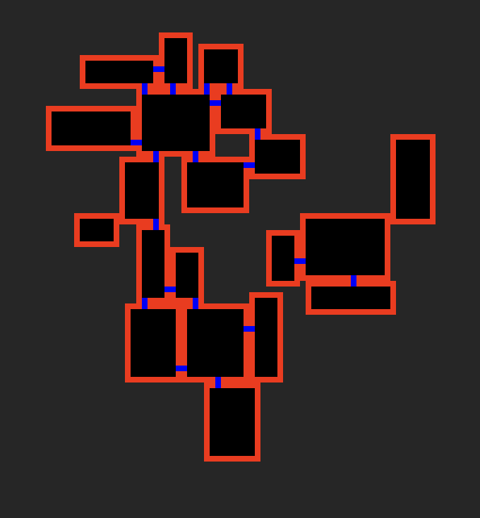

# SFRoguePlayground3
Swift playground used to cover coding challenges whilst writing SF Rogue
Playground for creating rooms, laying them out and connecting them, read the associated article that explains what this is for [SF Rogue Room Connection](https://www.flexicoder.com/SFRogue/SFRogue_Room_Connection.html)

